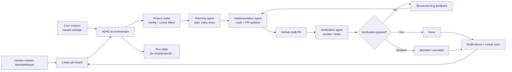

# Agent-Driven Development Hub (ADHD.ai)

ADHD.ai is a Harness engineering automatic-workflow hub. It turns ideas, tasks, and issues on a Linear job board into agent-driven engineering execution across one or many projects.

The purpose is simple: create an idea, task, or issue in Linear; ADHD.ai pulls the job, assigns it to the right project workflow, and processes it through specialized agents for planning, implementation, and verification. The workflow can also run as a scheduled cron mission to process variant cases, sweep eligible work, and send notifications about progress, failures, or completed verification.

## Purpose

- Use Linear as the job board for engineering ideas, tasks, and issues.
- Pull eligible jobs into ADHD.ai automatically by project, label, status, or explicit issue key.
- Process each job with a staged agent workflow: plan -> implement -> verify.
- Open and update GitHub PRs as implementation work progresses.
- Feed verification failures back into implementation until the job passes or is blocked.
- Support cron-style missions for recurring processing, variant-case sweeps, and operational automation.
- Send notifications through the connected workflow surfaces so humans can see progress and outcomes.

## System Diagram



## Workflow

1. A human creates an idea, task, or issue on the Linear job board.
2. ADHD.ai pulls the eligible Linear job for the configured project.
3. The planning agent turns the job into an implementation plan with risks and tests.
4. The implementation agent changes the code and opens or updates a GitHub PR.
5. The verification agent reviews and tests the PR work in a separate Codex session.
6. If verification fails, ADHD.ai sends structured bug feedback back to implementation and updates the same PR branch.
7. The loop repeats until verification passes or the job is blocked.
8. Linear status, labels, comments, and notifications stay synchronized with the current stage.

## Multi-Project Configuration

Configuration is loaded from `adhd-ai.config.ts` and resolved into project-specific runtime settings. Existing `piv-loop.config.ts` files are still accepted as a legacy fallback.

- Root defaults can define shared repo, linear, codex, skills, and dry-run behavior.
- Polling is a single global config at the root `polling` key (`intervalMs`, `maxCycles`, `exitWhenIdle`, `staleRunTimeoutMs`) and applies to all selected projects in a run.
- Optional `linear.projectId` can scope each ADHD.ai project to a specific Linear project when selecting assigned work.
- For targeted runs with `--all-projects --issue <KEY>`, ADHD.ai routes the issue to exactly one project by matching `linear.projectId` to the Linear issue's `projectId`.
- `projects` contains one or more project entries, each with:
  - `id` (required)
  - `name` (optional)
  - overrides such as `workspacePath`, `executionPath`, `repo`, `linear`, `codex`, `skills`, `dryRun`

Codex capability configuration can be set at root or per project:

- `codex.plugins`: plugin IDs to enable for spawned Codex sessions (translated to `--config plugins."<id>".enabled=true`)
- `codex.skillsets`: skillset names passed to Codex as a `skillsets=[...]` config override
- `codex.configOverrides`: raw `key -> TOML literal` map forwarded as repeated `--config key=value`

Path behavior:

- `workspacePath`: where ADHD.ai stores state and temp artifacts.
- `executionPath`: local repo path where `codex`, `git`, and `gh` commands run.

Run state is namespaced per project at:

` .piv-loop/projects/<project-id>/runs/<LINEAR_KEY>.json `

Legacy fallback for default project:

` .piv-loop/runs/<LINEAR_KEY>.json `

Routing notes:

- `project.id` is the ADHD.ai workspace/agent identifier used for execution path, state namespace, and workflow ownership.
- `linear.projectId` is the Linear project filter/routing key.
- If `--all-projects --issue` cannot resolve to one unique project (for example duplicate mappings or ambiguous unscoped projects), run with `--project <PROJECT_ID>`.

## Commands

```bash
bun run src/index.ts run --project default
bun run src/index.ts run --all-projects
bun run src/index.ts run --project default --issue ENG-123
bun run src/index.ts run --project default --poll
bun run src/index.ts run --project default --poll --poll-interval-ms 15000 --max-poll-cycles 20
bun run src/index.ts run --all-projects --poll --no-exit-when-idle
bun run src/index.ts status --project default --issue ENG-123
bun run src/index.ts projects

# after linking/installing the package bin
adhd-ai run --project default
adhd-ai projects
```

## Required Environment

Set these variables before running:

- `LINEAR_API_KEY`
- `LINEAR_PROJECT_ID` (optional; when set, only issues from this Linear project are eligible)
- `LINEAR_STATUS_ASSIGNED`
- `LINEAR_STATUS_PLANNING`
- `LINEAR_STATUS_IMPLEMENTING`
- `LINEAR_STATUS_PR_CREATED`
- `LINEAR_STATUS_REVIEWING`
- `LINEAR_STATUS_TESTING`
- `LINEAR_STATUS_BLOCKED`
- `LINEAR_STATUS_DONE`
- `LINEAR_LABEL_PR_CREATED` (optional, default `PR Created`)
- `LINEAR_LABEL_REVIEWING` (optional, default `Reviewing`)
- `LINEAR_LABEL_TESTING` (optional, default `Testing`)
- `LINEAR_AUTO_CREATE_LABELS` (optional, default `1`)

Optional:

The `PIV_*` environment variable namespace remains supported for compatibility with existing deployments.

- `GITHUB_REPO_OWNER`
- `GITHUB_REPO_NAME`
- `GITHUB_BASE_BRANCH` (default `main`)
- `PIV_WORKSPACE_PATH` (default current directory; state root)
- `PIV_EXECUTION_PATH` (default `PIV_WORKSPACE_PATH`; command execution path)
- `PIV_POLL_INTERVAL_MS` (default `30000`; polling sleep between cycles)
- `PIV_MAX_POLL_CYCLES` (optional; stop polling after this many cycles)
- `PIV_EXIT_WHEN_IDLE` (optional; default `1`, set `0` to keep polling when no issues are found)
- `PIV_STALE_RUN_TIMEOUT_MS` (optional; default `3600000`, requeue stale in-progress run states after this timeout)
  - these environment variables configure the single global polling loop
- `PIV_DRY_RUN=1` to avoid Linear/GitHub mutations
- `PIV_DEV_MODE=1` to stream Codex stdout/stderr logs during runs
- `CODEX_SANDBOX` (optional; leave empty to disable sandbox, or set `read-only`, `workspace-write`, `danger-full-access`)
- `CODEX_MODEL_PLAN` (optional; overrides planning model)
- `CODEX_MODEL_IMPLEMENT` (optional; overrides implementation model)
- `CODEX_MODEL_REVIEW_TEST` (optional; overrides review/testing model)
- `CODEX_HOME` to override Codex runtime state directory
- `PIV_LOG_LEVEL` (optional; default `info`)
- `PIV_LOG_PRETTY` (optional; default `1` in TTY, `0` otherwise)

`LINEAR_STATUS_*` values may be either Linear workflow state IDs or exact state names (for example `Todo`, `In Progress`, `Done`). Names are resolved to IDs at runtime.

When `--all-projects` is used, each configured ADHD.ai project applies its own `linear.projectId` filter (if configured). If `linear.projectId` is unset, behavior remains unchanged and issues are not filtered by Linear project.

Recommended mapping for your board:

- `assigned`: `Todo`
- `planning`: `In Progress`
- `implementing`: `In Progress`
- `pr_created`: `In Review`
- `reviewing`: `In Review`
- `testing`: `In Review`
- `blocked`: `Canceled`
- `done`: `Done`

Stage labels are applied automatically for:

- `pr_created` -> `PR Created`
- `reviewing` -> `Reviewing`
- `testing` -> `Testing`

## Quality Commands

```bash
bun run check
bun run typecheck
bun test
```

## Notes

- Run with authenticated `gh` (`gh auth status`).
- Codex uses the default CLI home unless you explicitly set `CODEX_HOME`.
- Linear integration uses the official `@linear/sdk` client.
